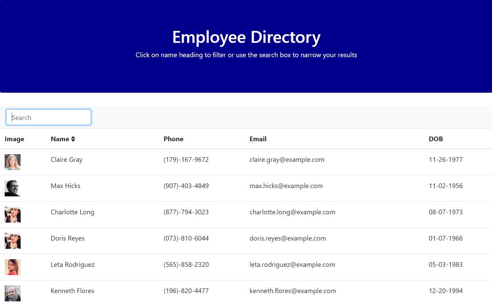

# Employee-Directory

## Description
For this assignment, I had to create an employee directory with React. This assignment required me to break up the application's UI into components, manage component state, and respond to user events. Employee data was generated with the randomuser.me API.

## Table of Content
  - [Technologies](#Technologies)
  - [License](#license)
  - [Resources](#Resources)
  - [Application](#Application)
  - [Screenshots](#Screenshots)
  - [Questions](#questions)

## Technologies
- React
- Bootstrap
- HTML
- CSS

## License
MIT License

Copyright (c) 2021 Lauracejas

Permission is hereby granted, free of charge, to any person obtaining a copy
of this software and associated documentation files (the "Software"), to deal
in the Software without restriction, including without limitation the rights
to use, copy, modify, merge, publish, distribute, sublicense, and/or sell
copies of the Software, and to permit persons to whom the Software is
furnished to do so, subject to the following conditions:

The above copyright notice and this permission notice shall be included in all
copies or substantial portions of the Software.

THE SOFTWARE IS PROVIDED "AS IS", WITHOUT WARRANTY OF ANY KIND, EXPRESS OR
IMPLIED, INCLUDING BUT NOT LIMITED TO THE WARRANTIES OF MERCHANTABILITY,
FITNESS FOR A PARTICULAR PURPOSE AND NONINFRINGEMENT. IN NO EVENT SHALL THE
AUTHORS OR COPYRIGHT HOLDERS BE LIABLE FOR ANY CLAIM, DAMAGES OR OTHER
LIABILITY, WHETHER IN AN ACTION OF CONTRACT, TORT OR OTHERWISE, ARISING FROM,
OUT OF OR IN CONNECTION WITH THE SOFTWARE OR THE USE OR OTHER DEALINGS IN THE
SOFTWARE.

## Resources
- [Random User API](https://randomuser.me/)
- [date-fns](https://www.npmjs.com/package/date-fns) I install this package to format the date of birth.
- [react-fontawesome](https://fontawesome.com/how-to-use/on-the-web/using-with/react) I install this package to insert the icon beside the name and sort the names in order ascendent and descendent.

## Application
[deployed-app]()

## Screenshots

## Questions
  If you have any question, Email me at: lauracejasmartin94@gmail.com 
  
  Find me on GitHub: [Lauracejas](https://github.com/Lauracejas)   
  
  ---

   _This README was generated with ❤️ by [README-generator](https://github.com/Lauracejas/Professional-README-Generator) © 2021_

